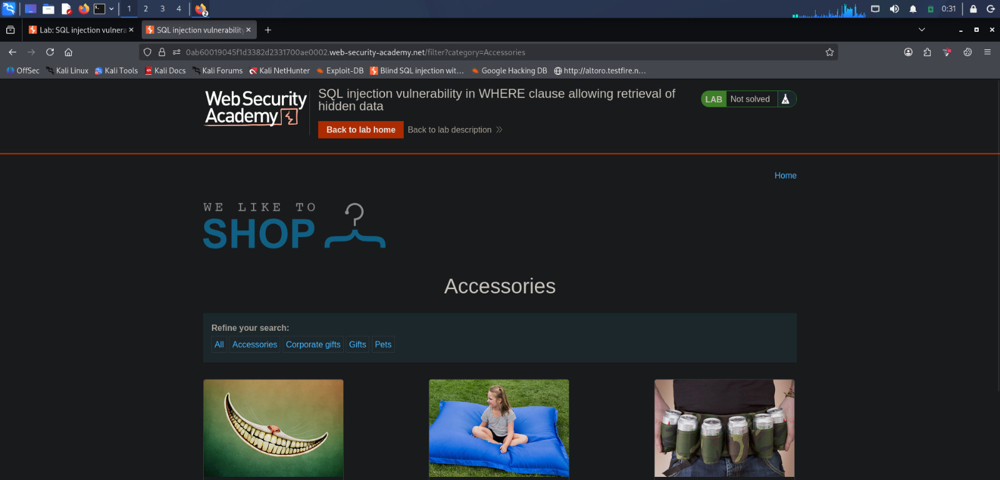

# Lab 01 - SQL Injection Vulnerability in WHERE Clause Allowing Retrieval of Hidden Data

## Lab Information

| Field | Details |
|-------|---------|
| Platform | PortSwigger Web Security Academy |
| Category | SQL Injection |
| Lab Name | SQL Injection Vulnerability in WHERE Clause Allowing Retrieval of Hidden Data |
| Difficulty | Apprentice |
| Testing Method | Manual Testing |
| Status | ✅ Solved |

---

# Objective

Identify a SQL Injection vulnerability in the `category` parameter and retrieve hidden (unreleased) products by modifying the SQL query.

---

# Testing Summary

| Item | Value |
|------|-------|
| Vulnerable Parameter | `category` |
| Injection Type | Boolean-based SQL Injection |
| Payload Used | `' OR 1=1--` |
| Result | Hidden products displayed |
| Tool Used | Web Browser |

---

# Vulnerability Overview

The application filters products using a SQL query similar to:

```sql
SELECT * FROM products
WHERE category='Accessories'
AND released=1;
```

The application directly inserts user-supplied input into the SQL query without proper validation or parameterized queries.

As a result, an attacker can manipulate the SQL query and retrieve data that should not be accessible.

---

# Manual Testing

## Step 1 - Identify the Input Parameter

Target URL:

```http
/filter?category=Accessories
```

The `category` parameter is passed directly to the backend SQL query, making it a suitable target for SQL Injection testing.

---

## Step 2 - Test for SQL Injection

### Payload

```sql
'
```

### Purpose

Injecting a single quote helps determine whether user input is processed as part of the SQL statement.

### Observation

The application's response changed, indicating that the input was not properly handled and suggesting a possible SQL Injection vulnerability.

---

## Step 3 - Exploit the Vulnerability

### Payload

```sql
' OR 1=1--
```

### Purpose

Modify the SQL query so that the WHERE condition always evaluates to TRUE.

### Original Query

```sql
SELECT * FROM products
WHERE category='Accessories'
AND released=1;
```

### Modified Query

```sql
SELECT * FROM products
WHERE category='' OR 1=1--'
AND released=1;
```

### Explanation

- `'` closes the original SQL string.
- `OR 1=1` creates a condition that always evaluates to TRUE.
- `--` comments out the remaining portion of the SQL query.

Because the WHERE clause always evaluates to TRUE, the application returns all products, including hidden (unreleased) products.

---

# Result

The payload successfully bypassed the intended filtering mechanism and displayed hidden products.

This confirms that the `category` parameter is vulnerable to SQL Injection.

---

# Impact

If this vulnerability exists in a production environment, an attacker could potentially:

- Retrieve hidden or confidential records.
- Bypass application restrictions.
- Extract sensitive database information.
- Escalate the attack to more advanced SQL Injection techniques.

---

# Mitigation

The following security practices help prevent SQL Injection vulnerabilities:

- Use Prepared Statements (Parameterized Queries).
- Validate and sanitize user input.
- Avoid constructing dynamic SQL queries.
- Apply the Principle of Least Privilege to database accounts.
- Use ORM frameworks where appropriate.

---

# Screenshots

## 1. Lab Overview


The PortSwigger lab description outlining the objective and the SQL Injection scenario.

---

## 2. Original Application



The application displays only released products before any testing is performed.

---

## 3. SQL Injection Test (`'`)


A single quote was inserted into the `category` parameter to observe how the application handled malformed SQL input.

---

## 4. SQL Injection Payload (`' OR 1=1--`)


The payload modified the SQL query so that the WHERE condition always evaluated to TRUE, causing all products to be displayed.

---

## 5. Lab Solved


Hidden products became visible, confirming successful exploitation of the SQL Injection vulnerability and completion of the lab.

---

# Key Learnings

- Identified a SQL Injection vulnerability through manual testing.
- Understood how Boolean-based SQL Injection manipulates SQL query logic.
- Learned how SQL comments (`--`) terminate the remainder of a SQL statement.
- Successfully exploited the vulnerability to retrieve hidden products.
- Reinforced the importance of manual testing before relying on automated tools.

---

# Next Step

Verify the same vulnerability using **SQLMap** and compare manual testing with automated verification techniques.
