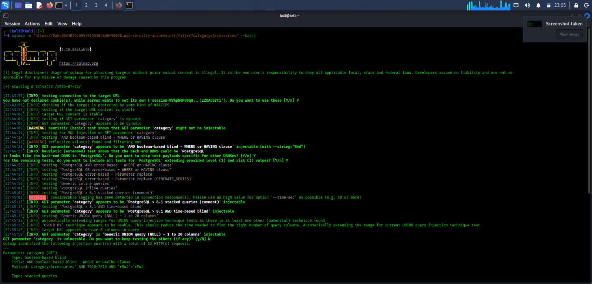
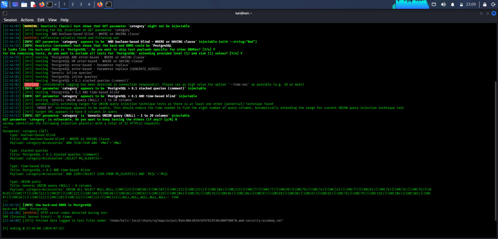

# Lab 01 - SQLMap Verification

## Lab Information

| Field | Details |
|-------|---------|
| Tool | SQLMap |
| Platform | PortSwigger Web Security Academy |
| Category | SQL Injection |
| Lab | SQL Injection Vulnerability in WHERE Clause Allowing Retrieval of Hidden Data |
| Difficulty | Apprentice |
| Testing Method | Automated |
| Status | ✅ Verified |

---

# Objective

Verify the SQL Injection vulnerability discovered during manual testing using SQLMap.

This verification confirms that the `category` parameter is vulnerable without performing unnecessary database enumeration.

---

# Target

```
https://<lab-url>/filter?category=Accessories
```

Replace `<lab-url>` with your PortSwigger lab URL.

Example:

```
https://0ab60019045f1d3382d2331700ae0002.web-security-academy.net/filter?category=Accessories
```

---

# SQLMap Command

```bash
sqlmap -u "https://<lab-url>/filter?category=Accessories" --batch
```

Example:

```bash
sqlmap -u "https://0ab60019045f1d3382d2331700ae0002.web-security-academy.net/filter?category=Accessories" --batch
```

---

# Command Explanation

| Option | Description |
|---------|-------------|
| `-u` | Specifies the target URL. |
| `--batch` | Automatically answers SQLMap prompts using default options. |

---

# Expected Result

SQLMap automatically tests the `category` parameter for SQL Injection vulnerabilities.

If the parameter is vulnerable, SQLMap:

- Detects the SQL Injection point.
- Identifies the SQL Injection technique.
- Fingerprints the backend Database Management System (DBMS).
- Reports the vulnerable parameter.

For this lab, database enumeration was intentionally **not performed** because the objective is only to verify the vulnerability.

---

# Solving the Lab

After SQLMap identifies the `category` parameter as vulnerable, the lab can be solved by modifying the vulnerable URL with a valid SQL Injection payload.

For this introductory lab, the classic SQL Injection payload below is sufficient:

```text
' OR 1=1--
```

Example:

```text
https://<lab-url>/filter?category=Accessories'+OR+1=1--
```

### Explanation

- `'` closes the original SQL string.
- `OR 1=1` creates a condition that always evaluates to TRUE.
- `--` comments out the remaining SQL query.

As a result, the application returns both released and hidden products.

The appearance of hidden products confirms that the SQL Injection attack was successful and the lab is solved.

---

# Screenshot

## SQLMap Command Execution



The screenshot shows SQLMap testing the `category` parameter for SQL Injection vulnerabilities.

---

## SQLMap Detection Result



SQLMap successfully detected that the `category` parameter is vulnerable to SQL Injection and identified the backend DBMS as PostgreSQL.

No database enumeration was performed because it is unnecessary for this lab.

---

# Comparison

| Manual Testing | SQLMap Verification |
|---------------|---------------------|
| Identified the vulnerability using manual payloads. | Automatically detected the vulnerable parameter. |
| Used the payload `' OR 1=1--` to retrieve hidden products. | Confirmed the SQL Injection vulnerability automatically. |
| Required manual analysis. | Faster and automated verification. |

---

# Conclusion

Manual testing successfully identified the SQL Injection vulnerability.

SQLMap independently verified the same vulnerability by automatically detecting the injectable `category` parameter and identifying the backend database.

Both manual testing and SQLMap produced the same result, confirming that the application is vulnerable to SQL Injection.

This lab demonstrates the importance of understanding manual exploitation techniques before using automated tools such as SQLMap.
