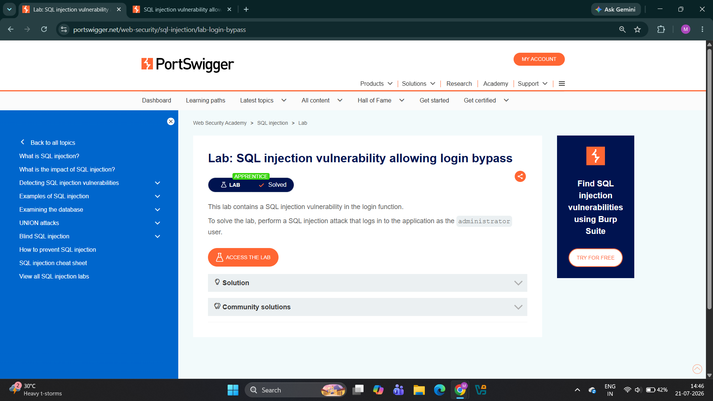
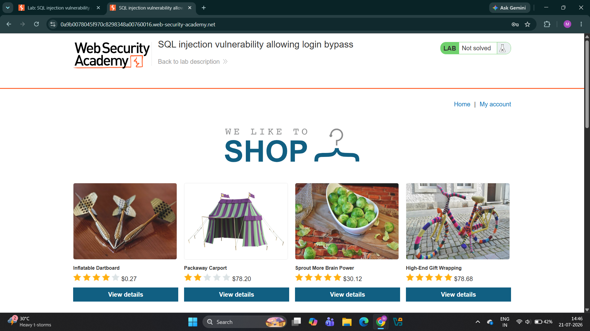
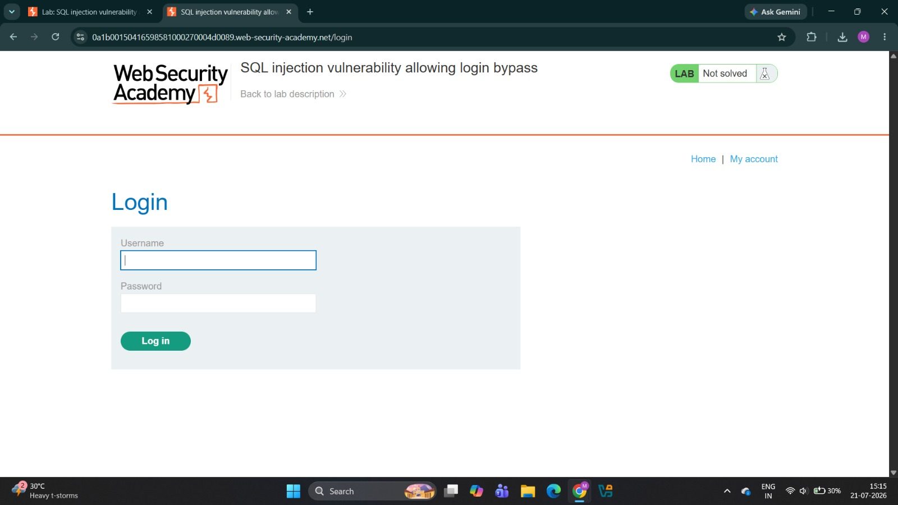
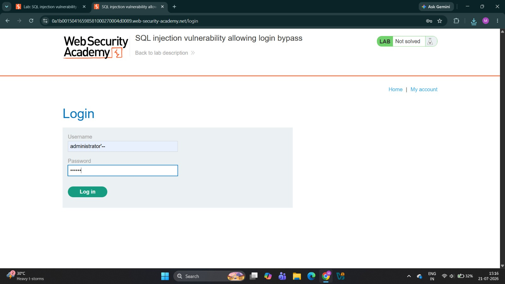
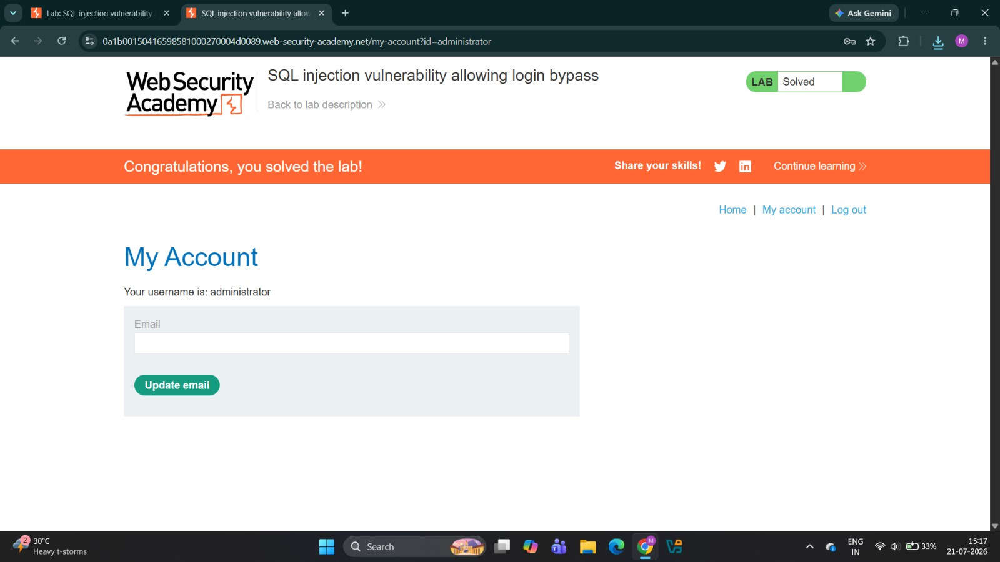

# Lab 02 - SQL Injection Vulnerability Allowing Login Bypass

## Lab Information

| Field | Details |
|-------|---------|
| Platform | PortSwigger Web Security Academy |
| Category | SQL Injection |
| Lab Name | SQL Injection Vulnerability Allowing Login Bypass |
| Difficulty | Apprentice |
| Testing Method | Manual Testing |
| Status | ✅ Solved |

---

# Objective

Authenticate as the `administrator` user by exploiting a SQL Injection vulnerability in the login functionality.

---

# Testing Summary

| Item | Value |
|------|-------|
| Vulnerable Parameter | `username` |
| Injection Type | Authentication Bypass |
| Payload Used | `administrator'--` |
| Result | Logged in as administrator |
| Tool Used | Web Browser |

---

# Vulnerability Overview

The login functionality constructs an SQL query using user-supplied input without proper validation or parameterized queries.

Because the username input is directly inserted into the SQL statement, an attacker can inject SQL syntax to bypass authentication and gain unauthorized access.

---

# Manual Testing

## Step 1 - Open the Lab

Launch the PortSwigger lab.



---

## Step 2 - Navigate to the Login Page

Open the login page from the application.





---

## Step 3 - Inject the SQL Payload

Enter the following payload into the **Username** field:

```text
administrator'--
```

Enter **any value** in the password field.

Click **Log in**.



---

## Step 4 - SQL Query Manipulation

### Original Query

```sql
SELECT * FROM users
WHERE username='administrator'
AND password='password';
```

### Modified Query

```sql
SELECT * FROM users
WHERE username='administrator'--'
AND password='anything';
```

### Explanation

- `administrator` specifies the target account.
- `'` closes the original SQL string.
- `--` begins a SQL comment.
- Everything after `--` is ignored by the database.
- As a result, the password verification is skipped.

The application authenticates the administrator account without validating the password.

---

# Result

The authentication process was successfully bypassed.

The application granted access to the **administrator** account without requiring the correct password.

This confirms that the login functionality is vulnerable to SQL Injection.

---

# Impact

If this vulnerability exists in a production environment, an attacker could potentially:

- Bypass authentication.
- Gain unauthorized access to user accounts.
- Log in as privileged users.
- Perform administrative actions.
- Compromise sensitive information.

---

# Mitigation

The following security practices help prevent SQL Injection vulnerabilities:

- Use Prepared Statements (Parameterized Queries).
- Never concatenate user input into SQL queries.
- Validate and sanitize user input.
- Apply the Principle of Least Privilege to database accounts.
- Use ORM frameworks where appropriate.

---

# Screenshots

## 1. Lab Overview


The PortSwigger lab description outlining the objective of bypassing authentication.

---

## 2. Home Page


The application's home page before authentication.

---

## 3. Login Page


The login form where the SQL Injection vulnerability exists.

---

## 4. Payload Entered


The payload `administrator'--` is entered into the username field while any password is supplied.

---

## 5. Lab Solved



The application authenticates the administrator account and the lab is successfully completed.

---

# Key Learnings

- SQL Injection vulnerabilities can affect authentication mechanisms.
- SQL comments (`--`) can bypass password validation.
- Authentication logic should never trust user input.
- Prepared Statements eliminate SQL Injection risks.
- Manual testing helps understand how authentication bypass attacks work before using automated tools.

---

# Next Step

Continue with the next PortSwigger SQL Injection lab to explore additional SQL Injection techniques and defenses.
